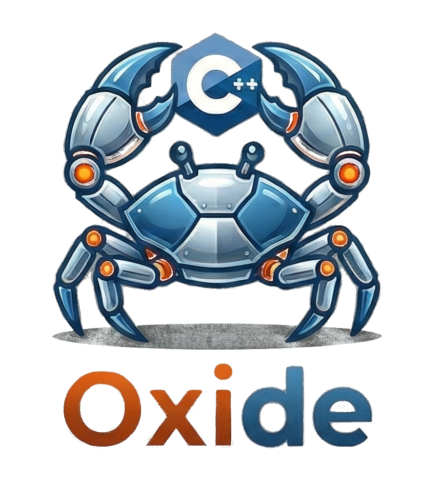

<div align="center">
  
  <br/>
  
  
  

  <p style="padding-top: 0.2rem;">
    <b>Rust-like Safety and Syntax for C++20.</b>
  </p>
</div>

## **Description**

Auxid is a header-only library that brings Rust's ownership semantics, safety primitives, and explicit mutability to C++. It aims to make C++ code safer, more expressive, and easier to reason about by adopting Rust's "strict" philosophy.

## **Features**

* ****Explicit Mutability:**** `Mut<T>` vs `const T` (enforced by tooling).  
* ****Error Handling:**** `Result<T, E>` with `AU_TRY` macros for ergonomic error propagation.  
* ****Rust Types:**** `Vec`, `String`, `Option`, `Result`, `Box`, `Arc`.  
* ****Safety Validator:**** A Clang-based tool to ban unsafe raw C++ declarations.

## **Roadmap**

Auxid is an ever evolving project with the goal of bringing compile-time memory safety to C++ through static analysis, here's our roadmap!

### Phase 1: The Foundation (Strict Immutability)
#### Focus: Enforcing "Immutable by Default" and establishing core Rust-like types.

- [x] Core Library: Mut<T> vs Const<T> syntax.
- [x] Core Library: Result<T, E> and Option<T> with AU_TRY macros.
- [x] Validator: Ban "naked" C++ variable declarations (e.g., int x;).
- [x] Tooling: Basic VS Code Extension for real-time validation.

### Phase 2: Ownership & Move Semantics (Current Focus)
#### Focus: Preventing "Use-After-Move" errors and managing resource ownership.

- [ ] Validator: Control Flow Graph (CFG) integration for data flow analysis.
- [ ] Validator: Detect and block usage of moved-from variables ("Use-After-Move").
- [ ] Library: Expanded Smart Pointer support (Box, Arc) with ownership tracking.
- [ ] Tooling: Auto-fix suggestions in VS Code.

### Phase 3: Lifetime Safety
#### Focus: Detecting dangling references and memory corruption.

- [ ] Validator: "Use-After-Free" detection for raw pointers and references.
- [ ] Validator: Escape analysis (preventing references from outliving their owners).
- [ ] Library: Thread-safety primitives (analogues to Rust's Send and Sync).

### Phase 4: The "Borrow Checker"
#### Focus: Full aliasing rules and mutation exclusivity.

- [ ] Validator: Enforce "One Mutable OR Many Immutable" references rule.
- [ ] Validator: Cross-function lifetime analysis.

## **Installation**

Auxid is a ****header-only**** library.

1.  Copy the `Include/auxid` folder to your project's include directory.  
2.  Include the main header: `#include <auxid/auxid.hpp>`

## **Quick Start**

```cpp  
#include <auxid/auxid.hpp>

// Optional: Use the short alias namespace 'au'  
using namespace au;

auto safe_divide(f32 a, f32 b) -> Result<f32> {  
    if (b == 0.0f) {  
        return fail("Division by zero");  
    }  
    return a / b;  
}

auto count() -> Result<void> {  
    // 1. Explicit Mutability  
    // Raw 'i32 x;' is banned by the AuxidValidator!  
    Mut<i32> counter = 0;  
    const i32 limit = 10;

    const auto flags = get_flags();

    auto buffer = mut(get_buffer());

    AU_UNUSED(flags);
    AU_UNUSED(buffer);

    // 2. Error Handling with AU_TRY  
    // Automatically propagates errors if safe_divide fails  
    f32 result = AU_TRY(safe_divide(100.0f, 2.0f));

    // 3. Statement Expressions (GCC/Clang Only)  
    // Initialize complex variables in a single expression block  
    const String message = AU_TRY({  
        if (result > 50.0f) {  
            fail("Result too large"); // returns Result<String>  
        }  
        Auxid::Internal::make_unexpected("Success"); // returns Result<String>  
    });
}
```

## **Tooling: AuxidValidator**

Auxid is more than just a library; it's a discipline. The **AuxidValidator** is a standalone Clang-based tool that enforces strict mutability.

It flags "unsafe" C++ declarations like:

```cpp 
int x = 5; // ❌ Violation: Variable 'x' has unsafe type 'int'.
```

> [!NOTE]
> You might be asking how exactly is `int x = 5;` unsafe?
> 
> By disallowing 'naked' types in variable declarations and requiring the programmer to either wrap them in `Const<T>` or `Mut<T>`, it forces them to stop and think if this variable truly needs to be marked `Mut<T>`, or if just `Const<T>` is sufficient. Hope here is promoting 'Immutable by Default' on C++ codebases. 

And demands:


```cpp 
Mut<int> x = 5;   // ✅ Allowed  
const int x = 5; // ✅ Allowed

const auto x = 5; // ✅ Allowed
auto x = mut(5); // ✅ Allowed
```

### **Validator Setup**

The validator requires a compilation database (compile_commands.json) to understand your code.

1. **Generate Compilation Database:**  
   * **CMake:** Run with -DCMAKE_EXPORT_COMPILE_COMMANDS=ON.  
   * **Bazel/Make:** Use tools like bear to generate it.  
2. **Run Manually:**  
   ```bash  
   ./auxid-validator <path/to/file.cpp> -p <path/to/compile_commands_folder>
   ```

## **VS Code Extension**

This repository includes a VS Code extension (auxid-vscode) that integrates the validator directly into your editor, highlighting unsafe declarations as warnings/errors in real-time.

**Configuration:**

* auxid.validatorPath: Path to the compiled auxid-validator executable.  
* auxid.buildPath: Path to the folder containing your compile_commands.json (defaults to workspace root).

## **Requirements**

* **C++ Standard:** C++20 or newer.  
* **Compilers:**  
  * **Linux/macOS:** GCC or Clang (Required for Statement Expressions).  
  * **Windows:** clang-cl is recommended. MSVC is **not supported** due to lack of Statement Expression support.

## **License**

Copyright (C) 2026 IAS. Licensed under the [Apache License, Version 2.0](http://www.apache.org/licenses/LICENSE-2.0).
