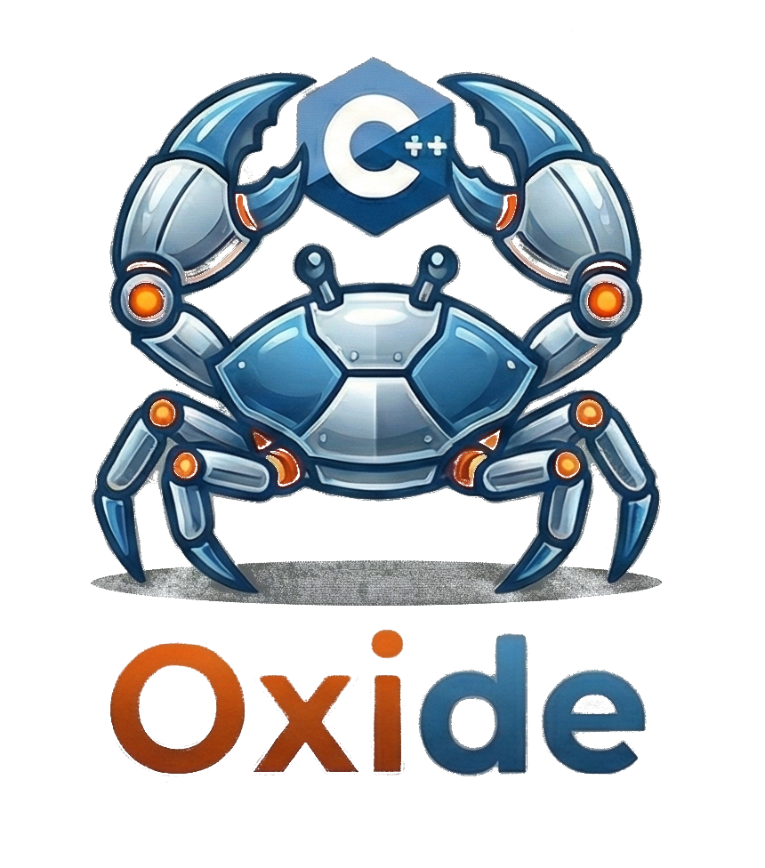

<div align="center">
  
  <br/>

  
  
  

  <p style="padding-top: 0.2rem;">
    <b>Auxid: The Orthodox C++ Platform.</b>
  </p>
</div>

## The vision

Auxid is a platform for building modern, high-performance C++ applications using **Orthodox C++** and **data-oriented design (DOD)**.

Mainstream “modern C++” often pays for heavy template metaprogramming, slow builds, and an STL whose node-based containers and allocator model work against CPU caches and DOD-friendly layouts. Auxid keeps the language close to fast, predictable, systems-style C++.

**LibAuxid** augments the standard library with a lean, DOD-oriented template layer built on explicit heap and arena allocation. Where the STL is already the right choice (for example, `std::filesystem`), LibAuxid exposes it through thin, LibAuxid-compatible inline wrappers with no extra overhead.

### Core features

- **No hidden overhead** - No `<iostream>`, no `<vector>`, no surprise allocations in the hot path.
- **Strong allocators** - Integrated [rpmalloc](https://github.com/mjansson/rpmalloc) for fast, thread-caching heap allocation, plus custom arena allocators.
- **Standard-algorithm friendly iterators** - Containers use iterators that satisfy the usual C++20 iterator concepts (for example, contiguous iterators where applicable), so you can use `std::sort`, ranges, and similar utilities without friction.
- **Cache-friendly containers** - Sparse–dense hash map, small-string-optimized string, and strictly aligned vector types.
- **Lightweight error types** - Union-based `Result<T, E>` and `Option<T>` that compile to tight representations, with Rust-style `AU_TRY` macros.

## The ecosystem

The Auxid platform spans two repositories for clarity and maintenance. **This repo** is **LibAuxid** (the core template library).

| Name | Description | Repository |
|------|-------------|------------|
| **LibAuxid** | Custom template library and core platform | [I-A-S/Auxid](https://github.com/I-A-S/Auxid) |
| **Project template** | Production-oriented scaffold for new Auxid projects | [I-A-S/Auxid-Project-Template](https://github.com/I-A-S/Auxid-Project-Template) |

## Quick start (CMake)

LibAuxid is meant to drop into an existing CMake project via `FetchContent`:

```cmake
cmake_minimum_required(VERSION 3.20)
project(MyOrthodoxEngine CXX)

include(FetchContent)

FetchContent_Declare(
  auxid
  GIT_REPOSITORY https://github.com/I-A-S/Auxid.git
  GIT_TAG        main  # Pin a release tag for stability in production
)
FetchContent_MakeAvailable(auxid)

auxid_setup_project()  # Optional: project-wide settings (e.g. C++20)

add_executable(my_app main.cpp)
target_link_libraries(my_app PRIVATE libauxid)
target_link_libraries(my_app PRIVATE auxid_platform_standard)  # Recommended (see below)
```

> [!NOTE]
> **Opt-in platform configuration**
>
> Auxid does not force strict compiler or linker flags by default. For a predictable “Orthodox C++” baseline, link **`auxid_platform_standard`** (recommended): it disables C++ exceptions (`-fno-exceptions` on Clang/GCC, `/EHs-c-` on MSVC), which helps keep control flow and performance characteristics explicit.

### Example

```cpp
#include <auxid/containers/vec.hpp>
#include <auxid/containers/string.hpp>

using namespace au;

auto main() -> int
{
    auxid::MainThreadGuard _main_thread_guard;

    // Custom Auxid containers mirror their std counterparts closely.
    Vec<String> names;
    names.push_back(String("Orthodox"));
    names.push_back(String("C++"));

    return 0;
}
```

## License

Copyright © 2026 I-A-S. Licensed under the [Apache License, Version 2.0](http://www.apache.org/licenses/LICENSE-2.0).
