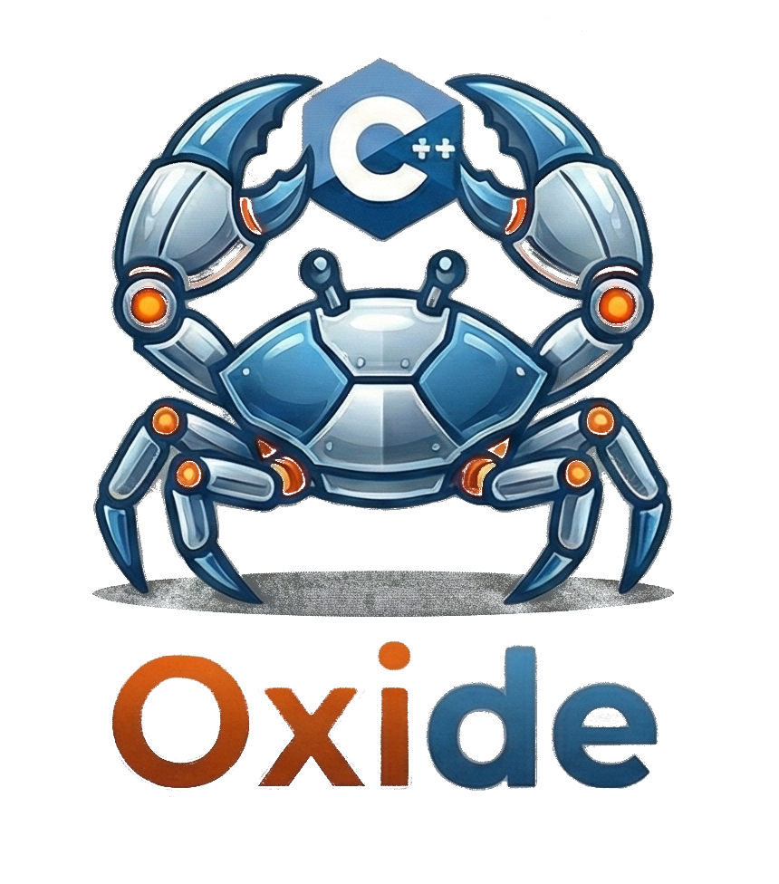

<div align="center">
  
  <br/>

  
  
  
  

  <p style="padding-top: 0.2rem;">
    <b>Auxid: The Rigid C++ Platform.</b>
  </p>
</div>

## The vision

Auxid is a platform for building modern, high-performance C++ applications using [**Rigid C++**](https://github.com/I-A-S/Rigid-Cpp) principles, delivered as a **C++23 named module**.

Mainstream "modern C++" often pays for heavy template metaprogramming, slow builds, and an STL whose node-based containers and allocator model work against CPU caches and DOD-friendly layouts. Auxid keeps the language close to fast, predictable, systems-style C++ - but it doesn't reject the STL. Where the standard library is already the right tool (contiguous storage, `std::filesystem`, `std::expected`, `std::optional`, ranges/iterator concepts), **LibAuxid composes with it**; where it isn't (small-string optimization, sparse-dense hashing, scoped arenas, strict allocator control), Auxid ships its own.

## Highlights

- **Modules-first API.** A single `import auxid;` gives you everything; tests pull in `import auxid.test;` separately. No mega-headers, no precompiled-headers.
- **No exceptions, ever.** `libauxid` propagates `-fno-exceptions` / `/EHs-c-` to every consumer via `PUBLIC` compile options. Errors flow through `Result<T>` and `AU_TRY`.
- **Strong allocators.** Integrated [rpmalloc](https://github.com/mjansson/rpmalloc) thread-caching heap, plus an `ArenaAllocator` for scoped bump-allocation. Both satisfy a single `memory::AllocatorType` concept, and `StdAllocatorAdapter` plugs them into standard containers.
- **STL interop built in.** `Vec<T>` is `std::vector<T, StdAllocatorAdapter<T, A>>`, `Pair` / `Span` are direct std aliases, `Result<T, E>` round-trips with `std::expected`, `Option<T>` round-trips with `std::optional`, and `auxid::filesystem` wraps `std::filesystem` with non-throwing `Result<T>` returns.
- **Cache-friendly custom containers.** SwissTable-style `HashMap` / `HashSet` (SIMD 16-slot group probing with SSE2/NEON/WASM SIMD128, triangular probing, per-instance random seed) over a dense entry array, `String` with little-endian SSO, `CompactVec<T>` (u32 index) and `TinyVec<T>` (u16 index), lock-free `SpscQueue<T, N>`.
- **Standard-algorithm friendly iterators.** `Vec`, `String`, `StringView`, and `Span` model `std::contiguous_iterator` and `std::ranges::contiguous_range`; `StringView` is a `std::ranges::borrowed_range`. `std::ranges::sort` on a `Vec<i32>` or a `String` Just Works!
- **Lightweight smart pointers.** `Box<T>` (allocator-aware `unique_ptr`), `Arc<T>` (atomic shared), `IntrusiveArc<T>` over a `RefCounted` base.
- **Cross-platform.** x64 / ARM64 on Linux, Windows, and macOS (Apple Silicon), plus WebAssembly via Emscripten.

## Module map

| Module             | Interface                                                              | Implementation                                                                                                 | Contents                                                                                                       |
| ------------------ | ---------------------------------------------------------------------- | -------------------------------------------------------------------------------------------------------------- | -------------------------------------------------------------------------------------------------------------- |
| `auxid`            | [include/auxid/auxid.ixx](include/auxid/auxid.ixx)                       | —                                                                                                              | Umbrella; re-exports `core`, `memory`, `containers`, `thread`, `fs`.                                           |
| `auxid.core`       | [include/auxid/auxid-core.ixx](include/auxid/auxid-core.ixx)             | [src/cppm/auxid-core.cpp](src/cppm/auxid-core.cpp)                                                             | Primitive aliases (`u8`..`u64`, `f32`/`f64`, `usize`), `Result<T, E>`, `panic`, `Mutex`.                       |
| `auxid.memory`     | [include/auxid/auxid-memory.ixx](include/auxid/auxid-memory.ixx)         | —                                                                                                              | `HeapAllocator` (rpmalloc), `ArenaAllocator`, `StdAllocatorAdapter`, `Box`, `Arc`, `IntrusiveArc`.             |
| `auxid.containers` | [include/auxid/auxid-containers.ixx](include/auxid/auxid-containers.ixx) | [src/cppm/auxid-containers.cpp](src/cppm/auxid-containers.cpp)                                                 | `String`/`StringView`, `Vec`/`CompactVec`/`TinyVec`, `HashMap`/`HashSet`, `Option`, `Pair`, `Span`, `SpscQueue`, hashing.|
| `auxid.thread`     | [include/auxid/auxid-thread.ixx](include/auxid/auxid-thread.ixx)         | [src/cppm/auxid-thread.cpp](src/cppm/auxid-thread.cpp)                                                         | `Thread`, `JThread`, `LockGuard`, `ConditionVariable`, thread init, `Logger`.                                |
| `auxid.fs`         | [include/auxid/auxid-fs.ixx](include/auxid/auxid-fs.ixx)                 | —                                                                                                              | Non-throwing `std::filesystem` wrappers returning `Result<T>`.                                                 |
| `auxid.test`       | [include/auxid/auxid-test.ixx](include/auxid/auxid-test.ixx)             | [src/cppm/auxid-test.cpp](src/cppm/auxid-test.cpp)                                                             | `Block`, `Runner`, `AutoRegister<T>` - tiny self-registering test framework.                                   |

## Quick start (CMake)

LibAuxid is meant to drop into an existing CMake project via `FetchContent`. **CMake 3.28+** is required (for `target_sources` `FILE_SET CXX_MODULES`).

```cmake
cmake_minimum_required(VERSION 3.28)
project(MyRigidEngine CXX)

include(FetchContent)

FetchContent_Declare(
  auxid
  GIT_REPOSITORY https://github.com/I-A-S/Auxid.git
  GIT_TAG        main  # Pin a release tag for stability in production
)
FetchContent_MakeAvailable(auxid)

auxid_setup_project()

add_executable(my_app main.cpp)
target_link_libraries(my_app PRIVATE libauxid)
```

> [!NOTE]
> **Compiler requirements**
>
> Auxid hard-errors at configure time on anything other than **Clang**, **Clang-CL**, **native MSVC**, or **GCC 15.2+** (see [cmake/auxid_setup_project.cmake](cmake/auxid_setup_project.cmake)). Your consumer code must compile at C++23, and `libauxid` will propagate `-fno-exceptions` / `/EHs-c-` to it - this is a property of the library, not opt-in.

## Example

```cpp
#include <auxid/macros.hpp>

import auxid;

using namespace au;

auto load_config() -> Result<String>
{
    AU_TRY_VAR(cwd, filesystem::current_path());
    (void) cwd;
    return String("hello");
}

auto main() -> int
{
    auxid::MainThreadGuard _main_thread_guard;

    Vec<String> names;
    names.push_back(String("Rigid"));
    names.push_back(String("C++"));

    auto cfg = load_config();
    if (cfg.is_err())
        return 1;

    HashMap<String, i32> counts;
    counts.insert(String("ok"), 1);

    return 0;
}
```

Notes:

- `auxid::MainThreadGuard` initializes per-thread state (rpmalloc, logger). `Thread::create` / `JThread::create` install a `WorkerThreadGuard` automatically.
- `AU_TRY_VAR(name, expr)` (defined in [include/auxid/macros.hpp](include/auxid/macros.hpp)) propagates errors from any `Result<T>` and binds the success value to `name`. `AU_TRY` / `AU_TRY_DISCARD` exist for assignment to an existing variable and for discarding the value.
- `filesystem::current_path()` is the non-throwing wrapper from `auxid.fs`; the underlying `std::filesystem::path` is exposed as `filesystem::Path`.

## Repository layout

```
.
├── include/auxid/
│   ├── macros.hpp                    # Public: AU_TRY*, platform/arch detection
│   └── *.ixx                         # Public module interfaces (export module)
├── src/
│   ├── cppm/*.cpp                    # Private module implementation units (module auxid.*;)
│   ├── c/vendor/rpmalloc/            # Vendored rpmalloc C source
│   └── h/vendor/                     # Internal header-only vendors (rpmalloc, wyhash)
├── tests/
│   ├── CMakeLists.txt                # Builds the TestSuite executable
│   └── cpp/                          # Unit tests grouped by feature
├── cmake/
│   ├── auxid_setup_project.cmake     # C++23 + C11 + arch defines + WASM tweaks
│   └── toolchains/                   # Per-target toolchain files
├── CMakeLists.txt                    # Top-level; calls auxid_setup_project()
├── CMakePresets.json                 # Configure / build / test presets
└── .github/workflows/ci.yaml         # Linux x64, macOS ARM64, Windows x64, WASM CI
```

## Supported compilers & platforms

- **Compilers** (configure-time enforced): Clang, Clang-CL, native MSVC, GCC 15.2+. macOS requires **Homebrew LLVM Clang** (`brew install llvm`); AppleClang is not supported (C++ modules).
- **Architectures** (auto-detected, exposes `AUXID_ARCH_X64` / `AUXID_ARCH_ARM64` / `AUXID_ARCH_WASM`): x86_64, ARM64, WebAssembly (Emscripten forces `AUXID_USE_SYSTEM_MALLOC`).
- **Configure presets** from [CMakePresets.json](CMakePresets.json):

  | Preset                  | Generator               | Target                          |
  | ----------------------- | ----------------------- | ------------------------------- |
  | `x64-linux`             | Ninja Multi-Config      | Linux x64 (Clang)               |
  | `x64-linux-gcc`         | Ninja Multi-Config      | Linux x64 (GCC 15.2)            |
  | `arm64-linux`           | Ninja Multi-Config      | Linux ARM64 (Clang cross)       |
  | `arm64-linux-gcc`       | Ninja Multi-Config      | Linux ARM64 (GCC 15.2 cross)    |
  | `arm64-darwin`          | Ninja Multi-Config      | macOS ARM64 (Homebrew LLVM Clang) |
  | `x64-windows-clang`     | Ninja Multi-Config      | Windows x64 (Clang)             |
  | `arm64-windows-clang`   | Ninja Multi-Config      | Windows ARM64 (Clang cross)     |
  | `x64-windows-msvc`      | Ninja Multi-Config      | Windows x64 (MSVC)              |
  | `arm64-windows-msvc`    | Ninja Multi-Config      | Windows ARM64 (MSVC)            |
  | `x64-windows-mingw-gcc` | Ninja Multi-Config      | Windows x64 (MinGW GCC 15.2)    |
  | `x64-windows`           | Visual Studio 18 2026   | Windows x64 (VS / MSVC)         |
  | `arm64-windows`         | Visual Studio 18 2026   | Windows ARM64 (VS / MSVC)       |
  | `wasm32-emscripten`     | Ninja Multi-Config      | WebAssembly (Emscripten)        |

- **CI** ([.github/workflows/ci.yaml](.github/workflows/ci.yaml)) currently covers `x64-linux`, `arm64-darwin`, `x64-windows`, `x64-windows-mingw-gcc` (experimental), and `wasm32-emscripten` on every push and PR to `main`.

## Building & testing locally

Pick a preset that matches your toolchain, then:

On macOS (Apple Silicon), install LLVM and Ninja first:

```bash
brew install llvm ninja
cmake --preset arm64-darwin
cmake --build --preset arm64-darwin --config Release
ctest --preset arm64-darwin --output-on-failure
```

Other platforms:

```bash
cmake --preset x64-windows-clang
cmake --build --preset x64-windows-clang --config Release
ctest --preset x64-windows-clang --output-on-failure
```

Tests are wired into a single `TestSuite` executable (see [tests/CMakeLists.txt](tests/CMakeLists.txt)); every translation unit under [tests/cpp/](tests/cpp/) self-registers via `test::AutoRegister<BlockType>`.

## The ecosystem

Explore the Auxid Ecosystem!

| Name | Description | Repository |
|------|-------------|------------|
| **LibAuxid** | Custom template library and core platform | [Auxid (This Repo)](https://github.com/I-A-S/Auxid) |
| **Project Template** | Scaffold for new Auxid projects (CMake Presets Included) | [Auxid-Project-Template](https://github.com/I-A-S/Auxid-Project-Template) |
| **IAUSB** | Cross-Platform USB Library for C++ | [IAUSB](https://github.com/IASoft-PVT-LTD/IAUSB) |
| **IANet** | Cross-Platform Networking Library for C++ | [IANet](https://github.com/IASoft-PVT-LTD/IANet) |
| **LaVista** | UI Platform for Modern C++ Desktop Apps | [LaVista](https://github.com/IASoft-PVT-LTD/LaVista) |
| **IAVis** | Real-Time Visualization Library | [IAVis](https://github.com/IASoft-PVT-LTD/IAVis) |
| **IAGHI** | IA Graphics Hardware Interface | [IAGHI](https://github.com/IASoft-PVT-LTD/IAGHI) |

## License

Copyright © 2026 I-A-S. Licensed under the [Apache License, Version 2.0](http://www.apache.org/licenses/LICENSE-2.0).
